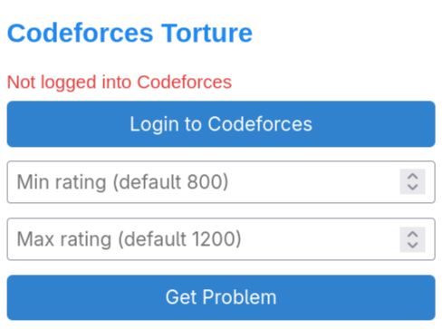
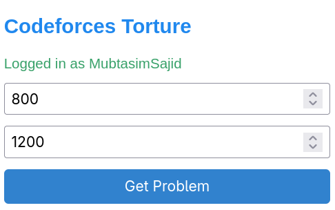
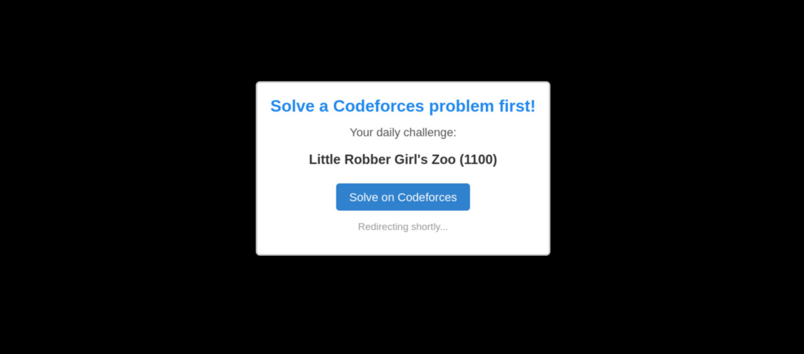

# Codeforces Torture

<p align="center">
  
</p>

> Browser extension to block distracting websites until a Codeforces problem is solved daily.

No more "I'll solve problems after I check this one thing." Open a non-Codeforces site without solving today's problem & you get a full-page overlay redirecting you straight to a randomly chosen unsolved problem from your rating range.

## Features





- **Daily Random Problem** - picks a fresh unsolved problem matching your rating range every day
- **Site Blocking** - overlays any non-Codeforces page with the problem & redirects you after 2 seconds (unless you've already solved a problem today)
- **Automatic Handle Detection** - scrapes your handle from codeforces.com if you're logged in
- **Rating Filter** - set min/max rating (rounded to nearest 100); defaults to 800-1200
- **Desktop Notifications** - get notified when a new daily problem is assigned

## Installation

```bash
git clone https://github.com/MubtasimSajid/Codeforces-Torture.git
cd Codeforces-Torture
```

Then load the extension into your browser:

### Chrome-based

1. Go to `chrome://extensions`
2. Enable **Developer mode** (top right)
3. Click **Load unpacked**
4. Select the `chrome/` directory

### Firefox-based

1. Go to `about:debugging#/runtime/this-firefox`
2. Click **Load Temporary Add-on**
3. Select `firefox/manifest.json`

It should also be available on [Firefox Add-Ons](https://addons.mozilla.org/en-US/firefox/addon/codeforces-torture/).

## Usage

1. Click the extension icon to open the popup
2. Popup auto-detects your Codeforces handle if you're logged in (or enter it manually to validate against the API)
3. Optionally adjust the rating range
4. Click **Get Problem** to immediately fetch a random unsolved problem, or wait for the daily alarm (fires 1 minute after install, then every 24 hours)

Once a problem is assigned, browsing non-Codeforces sites will redirect you to it until you submit a correct solution.

## Permissions

- `storage` - save handle, rating range, problem cache
- `alarms` - schedule daily problem refresh
- `notifications` - daily problem notification
- `tabs` - open Codeforces login / problem pages
- `<all_urls>` - inject content script & fetch from Codeforces API

## Tech Stack

Vanilla JavaScript (ES6+), HTML, CSS. No build tools, no dependencies. Compatible with Manifest V3 on both Chrome & Firefox.

## Motivation

Inspired by [Coding Sloth's](https://www.youtube.com/@TheCodingSloth) [YouTube video](https://youtu.be/e4ReFOWMG9o) on his extension of [LeetCode Torture](https://github.com/The-CodingSloth/haha-funny-leetcode-extension).

## Disclosure

AI & LLM were extensively used for project management, feature planning & actual coding.
